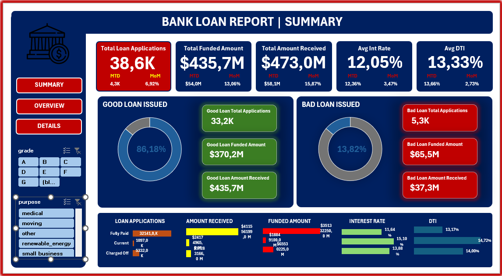
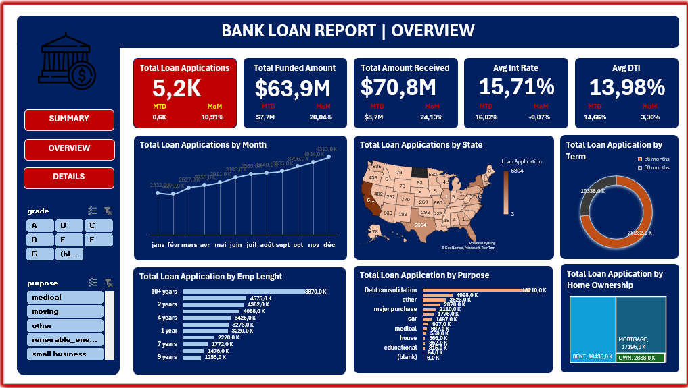

# Bank Loan Analysis Dashboard

Analysis of a bank's loan portfolio, built with Python for cleaning, PostgreSQL for KPI and trend queries, and Excel for a two-page interactive dashboard.

## Project overview

The dataset contains 38,576 loan records with 24 fields covering borrower details (state, employment length, home ownership, annual income), loan terms (amount, term, grade, sub-grade, interest rate), repayment status (loan status, total payment, last/next payment dates), and risk metrics (DTI, verification status).

The workflow has three stages:

1. **Python (pandas)** — load and inspect the raw CSV, check for missing values and structure.
2. **PostgreSQL (SQL)** — load the data into Postgres, convert date columns to proper `DATE` types, and compute the KPIs and breakdowns behind both dashboard pages.
3. **Excel** — two dashboard pages: a summary view (headline KPIs with month-to-date / previous-month-to-date comparisons) and an overview view (trends and breakdowns by category).

| Summary | Overview |
|---|---|
|  |  |

## Data preparation (Python)

- Loaded `financial_loan.csv` and reviewed structure and summary statistics with `df.describe()`.
- Checked for missing values with `df.isnull().sum()` (only `emp_title` had gaps, left as-is since it isn't used in the KPI calculations).
- Loaded the cleaned DataFrame into a PostgreSQL table (`loans`) using SQLAlchemy and psycopg2.

## Dashboard 1: Summary KPIs ([`firstdashboard.sql`](firstdashboard.sql))

Core portfolio health metrics, each computed as an overall total plus Month-to-Date (Dec 2021) and Previous-Month-to-Date (Nov 2021) comparisons:

- Total loan applications
- Total funded amount
- Total amount received
- Average interest rate
- Average debt-to-income (DTI) ratio

Plus a **good loan vs. bad loan** breakdown:
- Good loans (`Fully Paid` or `Current` status): application count, percentage of total, funded amount, and amount received
- Bad loans (`Charged Off` status): same four metrics
- Full loan status breakdown (count, amount received, amount funded, avg interest rate, avg DTI) — overall, MTD, and PMTD


## Dashboard 2: Trends and Breakdowns ([`dashboard2.sql`](dashboard2.sql))

Loan applications, funded amount, and amount received, broken down by:

- Monthly issue date trend
- State (regional analysis)
- Loan term
- Employment length
- Loan purpose
- Home ownership status


## Tech stack

- **Python**: pandas
- **Database**: PostgreSQL, SQLAlchemy, psycopg2
- **Visualization**: Excel (PivotTables, PivotCharts, slicers)
- **Environment**: Jupyter Notebook

## Repository structure

```
.
├── bank_loan.ipynb          # Data loading, inspection, PostgreSQL load
├── financial_loan.csv       # Raw dataset
├── financial_loan.xlsx      # Raw dataset (Excel version)
├── firstdashboard.sql       # Summary KPI queries (Dashboard 1)
├── dashboard2.sql           # Trend and breakdown queries (Dashboard 2)
├── images/
│   ├── summary_dashboard.png
│   └── overview_dashboard.png
└── README.md
```

## Setup

1. Clone the repository and install dependencies:
   ```bash
   pip install pandas sqlalchemy psycopg2-binary
   ```
2. Create a PostgreSQL database named `bank_loans`.
3. Set your database credentials as environment variables instead of hardcoding them:
   ```bash
   export DB_USER=postgres
   export DB_PASSWORD=your_password
   export DB_HOST=localhost
   export DB_PORT=5432
   export DB_NAME=bank_loans
   ```
   and load them in the notebook with `os.environ.get(...)` rather than typing the password directly into `create_engine`.
4. Run `bank_loan.ipynb` to load the data into Postgres.
5. Run `firstdashboard.sql` to convert date columns and compute the summary KPIs, then `dashboard2.sql` for the trend breakdowns.
6. Import the query results into Excel (or connect via Power Query) to rebuild the dashboard.

## Notes

- Date columns (`issue_date`, `last_credit_pull_date`, `last_payment_date`, `next_payment_date`) arrive as text in `DD-MM-YYYY` format and are converted to native `DATE` type at the start of `firstdashboard.sql`.
- MTD and PMTD figures are hardcoded to December 2021 and November 2021, matching the latest month in this dataset; update those `extract(...)` filters if you refresh the data with a later period.
- This is a standard portfolio/practice dataset (based on the widely used "Bank Loan Report" case study format).
